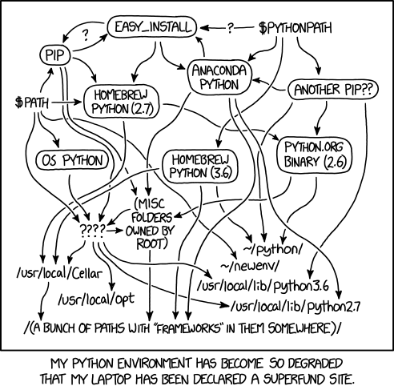

```{r xaringanExtra-clipboard, echo=FALSE}
xaringanExtra::use_clipboard()
```

# El camino de la serpiente para usuarios de R

.pull-center[<br>
```{r, echo=FALSE, out.width='80%', fig.align='center'}

```
]
---

# ¿Qué es Conda?

.pull-center[<br>
```{r, echo=FALSE, out.width='40%', fig.align='center'}

```
]

Conda es un gestor de paquetes, funciona para *casi todos* los lenguajes interpretados y para *algunos* que requieren compilación.

Originalmente orientado a usuarios Python .
---

# Parece chiste pero es anécdota

La Maldición de Perl: *There Is More Than One Way To Do It*

.pull-center[
```{r, echo=FALSE, out.width='45%', fig.align='center'}

```
]

---

# ¿Cómo conseguir Python?

* **Oficialmente**: instalador de la [Python Software Foundation](python.org). 
    - Windows, Linux y macOS.
    
* **Distro**: gestor de paquetes en Linux. 
    - DPKG, RPM, Pacman, Zypper, DNF. 
    
* **Homebrew**: usando el gestor de paquetes llamado Homebrew. 
    - Principalmente macOS, funciona en Linux.
    
* **Continuum**: Anaconda/Miniconda. Windows, Linux y macOS.

---

# Pythontitlán

**-titlán**: del náhuatl *tlantli*. Sufijo locativo que designa lo que se encuentra alrededor.
 
.pull-center[<br>
```{r, echo=FALSE, out.width='100%', fig.align='center'}

```
]

---

# ¿Por qué Conda?

- Es fácil de usar
- Es multiplataforma
- Funciona con recetas YAML
- Canales: Bioconda, r
- Se lleva bien con Python
- Maneja **entornos**
 
---

# Entornos virtuales

Es una ubicación del PATH, aislada del sistema, que previene conflictos de versiones.

.pull-center[<br>
```{r, echo=FALSE, out.width='35%', fig.align='center'}

```
]

---

.pull-left[<br><br><br><br><br><br><br>
.center[
# ¡Gracias! 
]
]

.pull-right[<br>
```{r, echo=FALSE, out.width='80%', fig.align='center'}
knitr::include_graphics("img/xolo.png")
```

]
